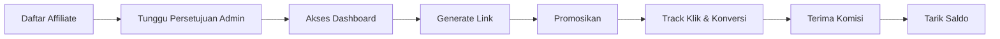

# 📢 Sistem Affiliate EksporYuk

Selamat datang di dokumentasi lengkap **Affiliate Program EksporYuk**! Program ini dirancang untuk membantu Anda menghasilkan komisi dengan mempromosikan membership, produk, dan kursus EksporYuk.

---

## 🎯 Apa Itu Affiliate EksporYuk?

**Affiliate** adalah mitra promosi EksporYuk yang mendapatkan **komisi** setiap kali ada orang yang membeli membership, produk, atau kursus melalui **link referral** Anda.

### Keuntungan Menjadi Affiliate:

✅ **Komisi Kompetitif** - Hingga 30% per penjualan  
✅ **Multi-Tier System** - Naik tier = komisi lebih besar  
✅ **Dashboard Lengkap** - Tracking real-time klik & konversi  
✅ **Short Link Generator** - Bikin link keren (contoh: `link.eksporyuk.com/dinda`)  
✅ **Challenge & Reward** - Ikut tantangan, raih bonus  
✅ **Marketing Tools** - Bio page, optin form, email templates  
✅ **Mini CRM** - Kelola leads & follow-up otomatis  
✅ **Payout Fleksibel** - Tarik komisi kapan saja (min. Rp 100.000)

---

## 🚀 Alur Kerja Affiliate (Ringkas)



---

## 📊 Struktur Tier & Komisi

| Tier | Minimum Sales | Komisi Membership | Komisi Produk | Komisi Kursus |
|------|---------------|-------------------|---------------|---------------|
| **Bronze** | 0 | 15% | 10% | 12% |
| **Silver** | 10 penjualan | 20% | 15% | 18% |
| **Gold** | 25 penjualan | 25% | 20% | 22% |
| **Platinum** | 50 penjualan | 30% | 25% | 28% |

**Catatan:** Tier otomatis naik saat target tercapai. Tier upgrade permanent (tidak turun).

---

## 🔗 Jenis Link Affiliate

### 1. **Affiliate Link (Standar)**
Link default dengan kode affiliate Anda:
```
https://eksporyuk.com/membership/premium?ref=DINDA123
```

**Fitur:**
- Auto-generated dari dashboard
- Tracking klik & konversi
- Bisa untuk membership, produk, kursus

### 2. **Short Link (Custom)**
Link pendek yang lebih profesional:
```
https://link.eksporyuk.com/dinda
https://ekspor.link/dinda/promo-akhir-tahun
```

**Fitur:**
- Username unik (cek ketersediaan dulu)
- Bisa tambah slug custom
- Multi-domain (pilih domain favorit)
- QR Code auto-generate
- Tracking detail (IP, device, referrer)

### 3. **Bio Page Link**
Landing page all-in-one untuk affiliate:
```
https://eksporyuk.com/bio/dinda
```

**Fitur:**
- 5 template desain (Minimalist, Vibrant, Professional, Creative, Elegant)
- Social media links
- CTA buttons (7 jenis)
- Visitor analytics
- Customizable colors & layout

---

## 📦 Fitur Utama Affiliate Booster Suite

### **Phase 1: Template Center**
Email & CTA templates untuk mempercepat promosi.

**Kategori Email:**
- Welcome Email
- Follow-Up Email
- Promo Email
- Reminder Email
- Educational Email
- Zoom Invitation
- Pending Payment
- Upsell Email

**Kategori CTA:**
- Membership CTA
- Course CTA
- Product CTA
- Optin CTA
- WhatsApp CTA
- Zoom CTA
- Custom CTA

### **Phase 2: Bio Page (Link-in-Bio)**
Landing page personal untuk semua link Anda.

**Komponen:**
- Profile info (foto, nama, bio)
- Social media icons
- CTA buttons (unlimited)
- View count tracking
- Mobile responsive

### **Phase 3: Optin Form Builder**
Bikin form optin untuk kumpulkan email/WhatsApp leads.

**Tab Konfigurasi:**
1. **Form Setup** - Title, description, button text
2. **Design** - Colors, button style, layout
3. **Fields** - Email, WhatsApp, custom fields
4. **Automation** - Email follow-up otomatis

### **Phase 4: Mini CRM**
Kelola leads dari optin form.

**Fitur:**
- Lead list dengan filter (status, source, date)
- Segmentasi leads (Hot, Warm, Cold)
- Export CSV
- Follow-up tracking
- Konversi leads ke customer

### **Phase 5: Broadcast System**
Kirim email/WhatsApp massal ke leads.

**Fitur:**
- Compose email dengan template
- Pilih segmen audience
- Schedule broadcast
- Track open rate & click rate
- Credit-based (1 credit = 1 email)

### **Phase 6: Automation Builder**
Otomatisasi follow-up dengan email sequence.

**Trigger Types:**
- **After Optin** - Kirim email setelah leads submit form
- **After Purchase** - Follow-up setelah customer beli
- **Zoom Follow-Up** - Reminder sebelum webinar
- **Pending Payment** - Ingatkan customer yang belum bayar

**Step Configuration:**
- Email subject & content
- Delay time (menit/jam/hari)
- Multi-step sequence (unlimited)

### **Phase 7: Credit System**
Sistem kredit untuk broadcast & automation.

**Harga Kredit:**
- 100 credits = Rp 50.000
- 500 credits = Rp 200.000 (20% discount)
- 1000 credits = Rp 350.000 (30% discount)

**Penggunaan:**
- 1 email broadcast = 1 credit
- 1 WhatsApp broadcast = 2 credits
- Automation steps = auto-deduct saat triggered

### **Phase 8: Training Center**
Kursus gratis untuk affiliate.

**Modul:**
- Cara Efektif Promosi di Media Sosial
- Strategi Closing Sales
- Copywriting untuk Affiliate
- Tracking & Analytics 101

**Progress Tracking:**
- Mark completed
- Certificate setelah semua modul selesai

### **Phase 9: Challenge & Leaderboard**
Ikut tantangan penjualan, raih reward.

**Jenis Challenge:**
- Sales Count (jumlah penjualan)
- Revenue (total omzet)
- Conversions (total konversi)
- New Customers (customer baru)

**Reward Types:**
- Bonus Komisi (cash to wallet)
- Tier Upgrade (naik tier permanen)
- Cash Bonus (bonus tunai langsung)

**Leaderboard:**
- Real-time ranking
- Filter by challenge
- Progress tracking
- Claim reward button

### **Phase 10: Analytics & Reports**
Dashboard statistik lengkap.

**Metrics:**
- Total Clicks (harian/mingguan/bulanan)
- Conversions & Conversion Rate
- Total Earnings (komisi)
- Top Performing Links
- Traffic Sources (referrer analysis)
- Device Breakdown (mobile/desktop)
- Geo Analytics (negara/kota)

**Export:**
- Download reports (PDF/CSV)
- Custom date range
- Per-link statistics

---

## 💰 Sistem Pembayaran Komisi

### **Cara Kerja Komisi:**

1. **Customer Beli via Link Anda**
   - Sistem detect link affiliate dari cookie/query string
   - Transaction created dengan `affiliateId`

2. **Admin/Founder/Co-Founder Fee**
   - Admin: 15% masuk `balancePending`
   - Founder: 60% dari sisa masuk `balancePending`
   - Co-Founder: 40% dari sisa masuk `balancePending`

3. **Komisi Affiliate**
   - Langsung masuk `wallet.balance` (withdrawable)
   - Persentase sesuai tier Anda
   - Real-time update

**Contoh Perhitungan:**
```
Harga Membership: Rp 1.000.000
Komisi Affiliate (Tier Silver - 20%): Rp 200.000

Sisa: Rp 800.000
- Admin (15%): Rp 120.000 → balancePending
- Founder (60% dari 680k): Rp 408.000 → balancePending
- Co-Founder (40% dari 680k): Rp 272.000 → balancePending

Affiliate Terima: Rp 200.000 (langsung ke balance)
```

### **Penarikan Saldo (Payout):**

**Syarat:**
- Minimum: Rp 100.000
- Balance tersedia (bukan pending)
- WhatsApp verified

**Proses:**
1. Request payout dari dashboard
2. Admin review dalam 1-3 hari kerja
3. Transfer ke rekening Anda
4. Notifikasi email + WhatsApp

**Status Payout:**
- `PENDING` - Menunggu review admin
- `APPROVED` - Disetujui, siap transfer
- `PROCESSING` - Sedang diproses transfer
- `COMPLETED` - Transfer selesai
- `REJECTED` - Ditolak (alasan di notes)

---

## 🔐 Security & Permissions

### **Affiliate Dashboard Access:**
- Role `AFFILIATE` required
- Session-based auth (NextAuth)
- CSRF protection enabled
- Ownership validation (hanya data sendiri)

### **Data Privacy:**
- Lead data encrypted
- Payment info secured
- Analytics anonymized (no PII)
- GDPR compliant

---

## 📱 Integrasi

### **Mailketing Integration**
- Auto-sync leads ke list Mailketing
- Broadcast via Mailketing API
- Track email open/click rates

### **Starsender Integration**
- WhatsApp broadcast via Starsender
- Template approval required
- Delivery tracking

### **Xendit Integration**
- Payment processing
- Affiliate commission auto-calculate
- Transaction webhook

---

## 🆘 Support & Resources

### **Butuh Bantuan?**

1. **Dokumentasi**
   - Cek halaman FAQ Affiliate
   - Video tutorial di Training Center

2. **Support Channel**
   - Email: affiliate@eksporyuk.com
   - WhatsApp: +62 812-3456-7890
   - Live Chat: Dashboard affiliate (jam kerja)

3. **Community**
   - Grup WhatsApp Affiliate
   - Forum diskusi internal
   - Webinar bulanan

---

## 🎓 Quick Start Guide

### **Langkah 1: Daftar**
1. Klik "Daftar Affiliate" di dashboard
2. Isi data lengkap
3. Tunggu persetujuan admin (1-2 hari)

### **Langkah 2: Setup Profile**
1. Lengkapi profile affiliate
2. Set WhatsApp number (untuk notifikasi)
3. Upload foto profile

### **Langkah 3: Generate Link**
1. Pilih membership/produk yang mau dipromosikan
2. Klik "Generate Link"
3. Copy & share ke media sosial

### **Langkah 4: Promosikan**
1. Post di Instagram, Facebook, Twitter
2. Kirim ke grup WhatsApp/Telegram
3. Share di email list Anda

### **Langkah 5: Track & Optimize**
1. Monitor klik & konversi di dashboard
2. Lihat link mana yang paling efektif
3. Double down on yang convert tinggi

### **Langkah 6: Tarik Komisi**
1. Tunggu balance ≥ Rp 100.000
2. Request payout
3. Tunggu transfer dari admin

---

## 📈 Tips Sukses Affiliate

### **1. Pilih Produk yang Anda Pahami**
Jangan promosi asal-asalan. Pahami value dari membership/produk.

### **2. Gunakan Storytelling**
Ceritakan pengalaman pribadi atau customer Anda yang sukses.

### **3. Manfaatkan Bio Page**
Bikin landing page profesional dengan bio page.

### **4. Konsisten Follow-Up**
Gunakan automation untuk follow-up leads yang belum convert.

### **5. Analisis Data**
Check analytics, lihat pattern apa yang berhasil.

### **6. Ikut Challenge**
Join challenge untuk dapat bonus ekstra.

### **7. Build Audience**
Fokus build email list & WhatsApp list sendiri.

---

## 🗺️ Roadmap Menu Affiliate

```
📊 Dashboard
├─ Statistik (klik, konversi, earnings)
├─ Quick actions (generate link, share materials)
└─ Recent activity

🔗 Link & Tracking
├─ Affiliate Links (list & generate)
├─ Short Links (custom URL creator)
└─ Link Analytics (per-link stats)

💰 Earnings & Payouts
├─ Earnings (total komisi)
├─ Payouts (withdraw history)
└─ Wallet (balance & pending)

🎯 Challenge & Leaderboard
├─ Active Challenges
├─ Leaderboard (ranking)
└─ Claim Rewards

🎨 Marketing Tools
├─ Bio Page (link-in-bio)
├─ Optin Forms (lead magnet)
├─ Templates (email & CTA)
└─ Marketing Materials (banner, copy, logo)

📧 Automation & Broadcast
├─ Mini CRM (lead management)
├─ Broadcast (email/WA blast)
├─ Automation (sequence builder)
└─ Credits (balance & purchase)

📈 Analytics & Reports
├─ Performance (traffic, conversion)
├─ Reports (downloadable)
└─ Top Links (best performers)

🎓 Training & Resources
├─ Training Center (courses)
├─ FAQ (common questions)
└─ Support (contact admin)

⚙️ Settings
├─ Profile (edit info)
├─ Notifications (email/WA)
└─ Security (password)
```

---

## 🎉 Siap Mulai?

Daftar sekarang dan mulai earning dari program affiliate terbaik di industri ekspor Indonesia!

👉 [Daftar Affiliate](/affiliate/registration)  
👉 [Lihat Challenge](/affiliate/challenges)  
👉 [Training Gratis](/affiliate/training)

---

**Versi Dokumentasi:** 1.0  
**Terakhir Update:** 8 Desember 2025  
**Total Fitur:** 10 Phases Complete (100%)
